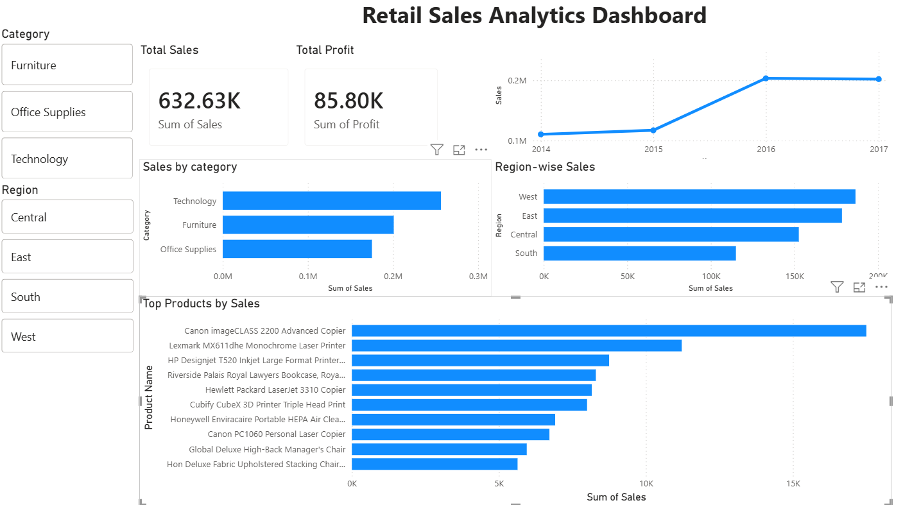
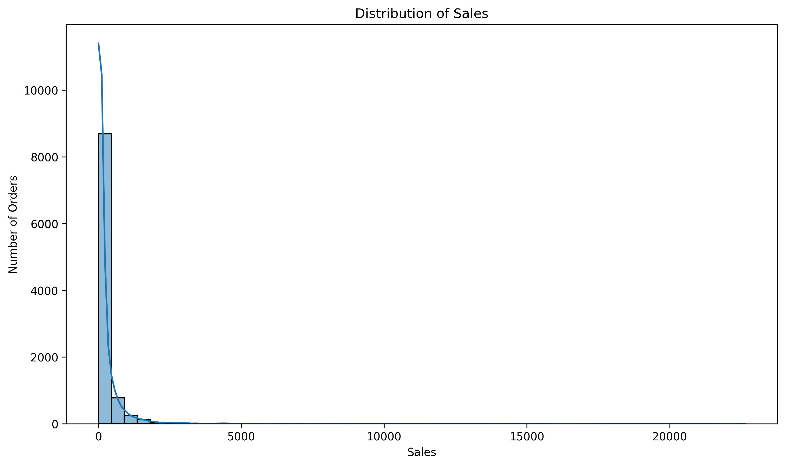

# 📊 Retail Sales Analytics Dashboard

An end-to-end retail analytics project that transforms raw sales data into actionable business insights using Python, SQL, and Power BI. The project covers data cleaning, exploratory data analysis (EDA), SQL-based business queries, and an interactive Power BI dashboard for decision-making.

---

## Project Objectives

- Analyze retail sales performance across products, categories, and regions.
- Identify key drivers of revenue and profitability.
- Discover sales trends and customer purchasing patterns.
- Build an interactive dashboard for business stakeholders.
- Demonstrate a complete analytics workflow from raw data to visualization.

---

## Tech Stack

- **Python**
  - Pandas
  - Matplotlib
  - Seaborn
- **SQL**
- **Power BI**
- **Jupyter Notebook**

---

## Dataset

**Superstore Sales Dataset**

- **Rows:** 9,994
- **Columns:** 21

The dataset includes:

- Orders
- Sales
- Profit
- Discount
- Quantity
- Customer Information
- Product Information
- Shipping Details
- Regional Information

---

## Project Workflow

```
Raw Dataset
      │
      ▼
Data Cleaning (Python)
      │
      ▼
Exploratory Data Analysis
      │
      ▼
SQL Business Analysis
      │
      ▼
Power BI Dashboard
      │
      ▼
Business Insights & Recommendations
```

---

## Project Structure

```
retail-sales-dashboard/
│
├── data/
│   └── SampleSuperstore.csv
│
├── notebook/
│   └── eda.ipynb
│
├── scripts/
│   └── preprocess.py
│
├── sql/
│   └── analysis-queries.sql
│
├── power BI/
│   └── Retail Sales Dashboard.pbix
│
├── Insights/
│   ├── correlation_heatmap.png
│   ├── category_sales.png
│   ├── monthly_sales_trend.png
│   └── ...
│
├── requirements.txt
└── README.md
```

---

# Exploratory Data Analysis

dashboard preview:


The notebook includes:

The project includes comprehensive exploratory data analysis to uncover trends, patterns, and relationships within the retail sales dataset.

### Sales Distribution



### Category-wise Sales


### Regional Sales Performance


### Correlation Heatmap


---

# Dashboard Features

- KPI Cards
  - Total Sales
  - Total Profit
  - Total Orders

- Sales Trend Analysis

- Category Performance

- Regional Performance

- Top Selling Products

- Interactive Filters

- Drill-down Analysis

---

# Key Business Insights

### Technology drives the highest revenue

Technology products contribute the largest share of total sales, making them a primary revenue driver.

---

### High discounts reduce profitability

Products with larger discounts frequently generate lower profits, indicating that aggressive discounting negatively impacts margins.

---

### Seasonal sales spikes exist

Sales fluctuate significantly throughout the year, suggesting opportunities for seasonal inventory planning and marketing campaigns.

---

### Revenue is concentrated

A relatively small number of products contribute a significant percentage of total sales, making inventory optimization especially important.

---

### Regional performance varies

Certain regions consistently outperform others, highlighting opportunities for localized marketing strategies and operational improvements.

---

# Business Recommendations

- Optimize discount strategies to protect profit margins.
- Increase inventory for consistently high-performing products.
- Focus marketing efforts on underperforming regions.
- Improve profitability of low-margin product categories.
- Use historical sales trends for demand forecasting.

---

# Future Enhancements

- Sales Forecasting
- Customer Segmentation
- RFM Analysis
- Profit Prediction using Machine Learning
- Interactive What-if Analysis in Power BI

---
# Getting Started

## Clone the Repository

```bash
git clone https://github.com/DhanushJami/retail-sales-analytics.git
```

## Install Dependencies

```bash
pip install -r requirements.txt
```

## Project Workflow

1. Explore the raw dataset in the `data` folder.
2. Run `scripts/preprocess.py` to clean and prepare the data (if applicable).
3. Open `notebook/eda.ipynb` to perform exploratory data analysis.
4. Execute the SQL queries in `sql/analysis-queries.sql` for business insights.
5. Open the Power BI dashboard (`.pbix`) to interact with the visualizations.

## Author

**Venkata Dhanush Jami**

Computer Science (Data Science) Student

Gitam University
